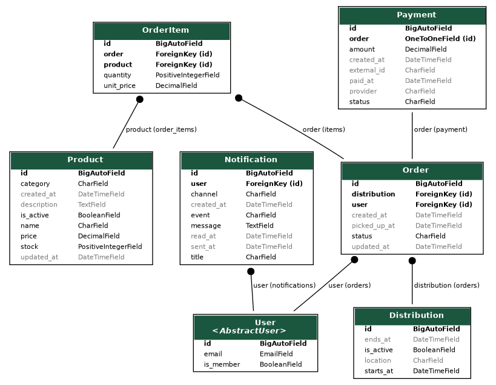

# Epicer'INT

Application Django pour centraliser la gestion des produits, des membres et des distributions alimentaires d'Épicer'INT.

## Lancer le projet

Prérequis : Git, Docker Compose et Bash (Git Bash ou WSL sous Windows).

```bash
git clone https://github.com/RabahSend/Epicer-int.git
cd Epicer-int
sh ./run.sh
```

L'application est accessible sur [http://localhost:8000](http://localhost:8000).

## Comptes par défaut

Un compte administrateur est créé automatiquement au démarrage de Docker :
```bash
docker compose exec web python manage.py createsuperuser
```

Pour générer le diagramme des modèles de données du projet :

```bash
docker compose exec web python manage.py graph_models users catalog orders notifications core -o models.png
```

Pour arrêter les services :

```bash
docker compose down
```

## Règles d'accès

- Les visiteurs peuvent consulter les produits actifs et leur disponibilité.
- La création d'un compte ne valide pas une cotisation et ne donne pas accès au panier.
- Après cotisation auprès de l'association, un administrateur active le champ « cotisation active » du compte dans l'administration Django. Seuls les membres actifs peuvent ajouter des produits au panier, dans la limite du stock.
- Le panier sert actuellement à préparer une sélection. Le paiement en ligne et la validation d'une commande ne sont pas encore disponibles.

---

# Cahier des charges - Epicer'INT

## 1. Présentation du projet

Le projet consiste à développer un site web pour **Epicer'INT** permettant de faciliter la gestion des produits, des cotisants, des commandes et des distributions.

Epicer'INT organise régulièrement des distributions alimentaires à destination des étudiants de **Télécom SudParis** et **IMT-BS**.

Ces distributions proposent différents types de produits, notamment :

* des féculents ;
* des fruits et légumes frais ;
* des conserves ;
* des produits sucrés.

Actuellement, certaines informations, notamment celles concernant les cotisants, sont gérées à l'aide d'une feuille Excel.

L'objectif du projet est de centraliser et de simplifier une partie de cette gestion au sein d'une application web.

---

## 2. Objectifs

Le site devra permettre :

* la gestion des produits et des stocks ;
* la création et la gestion des comptes des cotisants ;
* l'authentification des utilisateurs ;
* l'achat et le paiement des produits directement depuis le site ;
* la gestion de la récupération des commandes ;
* l'envoi de notifications aux utilisateurs ;
* éventuellement, la mise à disposition d'un tableau de bord pour les administrateurs.

---

## 3. Fonctionnalités

- **E-mail :** `admin@epicerint.local`
- **Mot de passe :** `projetinfo1A`

L'administration est accessible sur [http://localhost:8000/admin/](http://localhost:8000/admin/). Ces identifiants sont réservés au développement local : change le mot de passe avant tout déploiement. Les identifiants peuvent être personnalisés avec les variables `DJANGO_SUPERUSER_EMAIL` et `DJANGO_SUPERUSER_PASSWORD`.

## Roadmap

- [x] Gestion des comptes des cotisants et authentification
- [x] Gestion des produits et des stocks
- [x] Consultation du catalogue et préparation du panier
- [ ] Passage et validation des commandes
- [ ] Paiement en ligne
- [ ] Organisation du retrait des commandes lors des distributions
- [ ] Notifications aux utilisateurs
- [ ] Tableau de bord administrateur (optionnel)

## Modèle de données



Pour régénérer le graphe :

```bash
docker compose exec web python manage.py graph_models users catalog orders notifications core --disable-abstract-fields --exclude-models AbstractUser,AbstractBaseUser,PermissionsMixin,Group,Permission -o /tmp/models.png
docker compose cp web:/tmp/models.png docs/models.png
```
